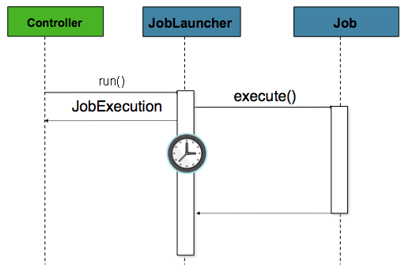

# 4.5 Running a Job #

运行一个批处理任务至少有两点要求：一个`JobLauncher`和一个用来运行的`job`。它们都包含了相同或是不同的`context`。举例来说，从命令行来启动job，会为每一个job初始化一个JVM，因此每个job会有一个自己的 **JobLauncher**；从web容器的HttpRequest来启动job，一般只是用一个 **JobLauncher** 来异步启动job，http请求会调用这个 **JobLauncher** 来启动它们需要的job。

## 4.5.1 从命令行启动 Jobs ##

对于使用企业级调度器来运行job的用户来说，命令行是主要的使用接口。这是因为大多数的调度器是之间工作在操作系统进程上(除了Quartz, 否则使用 `NativeJob`)，使用shell脚本来启动。除了shell脚本还有许多脚本语言能启动java进程，如Perl和Ruby，甚至一些构建工具也可以，如ant和maven。但是大多数人都熟悉shell脚本，这个例子主要展示shell脚本。

**The CommandLineJobRunner**

由于脚本启动job需要开启java虚拟机，那么需要有一个类带有main方法作为操作的主入口点。Spring Batch针对这个需求提供了一个实现： **CommandLineJobRunner** 。需要强调的是这只是引导你的应用程序的一种方法，有许多方法能够启动java进程，不应该把这个类视为最终方法。**CommandLineJobRunner**执行四个任务：

- 加载适当的 `ApplicationContext`
- 解析到 `JobParameters` 的命令行参数
- 根据参数确定合适的任务
- 使用在application context(应用上下文)中所提供的 `JobLauncher` 来启动job。

所有这些任务只要提供几个参数就可以完成。以下是要求的参数：

Table 4.1. CommandLineJobRunner arguments

	jobPath	用于创建ApplicationContext的xml文件地址。这个文件包含了完成任务的一切配置。
	
	jobName	需要运行的job的名字。

参数中必须路径参数在前，任务名参数在后。被设置到JobParameter中的参数必须使用"`name=value`"的格式：

    bash$ java CommandLineJobRunner endOfDayJob.xml endOfDay schedule.date(date)=2007/05/05

大多数情况下在jar中放置一个manifest文件来描述main class，但是直接使用class会比较简洁。还是使用 [domain section](http://docs.spring.io/spring-batch/trunk/reference/html/domain.html)中的‘EndOfDay’例子，第一个参数是'endOfDayJob.xml'，这是包含了Job和Spring ApplicationContext；第二个参数是'endOfDay'，指定了Job的名字；最后一个参数'schedule.date(date)=2007/05/05'会被转换成JobParameters。例子中的xml如下所示：

	<job id="endOfDay">
	    <step id="step1" parent="simpleStep" />
	</job>
	
	<!-为清晰起见省略了Launcher的详细信息-->
	<beans:bean id="jobLauncher"
         class="org.springframework.batch.core.launch.support.SimpleJobLauncher" />

例子很简单，在实际案例中Spring Batch运行一个Job通常有多得多的要求，但是这里展示了 **CommandLineJobRunner** 的两个主要要求：`Job` 和 `JobLauncher`。

**ExitCodes**

使用企业级调度器通过命令行启动一个批处理任务后，大多数调度器都是在进程级别沉默的工作。这意味着它们只知道一些操作系统进程信息(如它们执行的脚本)。在这种场景下，只能通过返回code来和调度器交流job执行成功还是失败的信息。返回code是返回给调度程序进程的一个数字，用于指示运行结果。最简单的一个例子：0表示成功，1表示失败。更复杂的场景如：job A返回4就启动job B，返回5就启动job C。这种类型的行为被配置在调度器层级，但重要的是像Spring Batch这种处理框架需要为特殊的批处理任务提供一个返回'Exit Code'数字表达式。在SpringBatch中，退出代码被封装在**ExitStatus**，具体细节会在Chapter 5中介绍。对于`exit code`，只需要知道**ExitStatus**有一个`exit code`属性能够被框架或是开发者设置，作为**JobLauncher**返回的**JobExecution**的一部分。**CommandLineJobRunner** 使用 **ExitCodeMapper** 接口将字符串的值转换为数值：

	public interface ExitCodeMapper {
	
	    public int intValue(String exitCode);
	
	}

**ExitCodeMapper** 的基本协议是传入一个字符串，返回一个数字表达式。job运行器默认使用的是 **SimpleJvmExitCodeMapper**，完成返回0，一般错误返回1，上下文找不到**job**，这类job运行器启动级别的错误则返回2。如果需要比上面三个值更复杂的返回值，就提供自定义 **ExitCodeMapper** 的实现。由于 **CommandLineJobRunner** 是创建 **ApplicationContext** 的类，不能够使用绑定功能，所以所有的值都需要覆盖后使用自动绑定，因此 **ExitCodeMapper** 在 **BeanFactory** 中加载，就会在上下文被创建后注入到job运行器中。而所有需要做的就是提供自己的 **ExitCodeMapper** 描述为 **ApplicationContext** 的一部分，使之能够被运行器加载。

## 4.5.2 在 Web Container 内部运行 Jobs ##

过去，像批处理任务这样的离线计算都需要从命令行启动。但是，许多例子(包括报表、点对点任务和web支持)都表明，从HttpRequest启动是一个更好的选择。另外，批处理任务一般都是需要长时间运行，异步启动时最为重要的：

 
这个例子中的Controller就是spring MVC中的Controller(Spring MVC的信息可以在 [http://docs.spring.io/spring/docs/3.2.x/spring-framework-reference/html/mvc.html](http://docs.spring.io/spring/docs/3.2.x/spring-framework-reference/html/mvc.html) 中查看)。Controller通过使用配置为异步的([asynchronously](http://docs.spring.io/spring-batch/trunk/reference/html/configureJob.html))JobLauncher启动job后立即返回了JobExecution。job保持运行，这个非阻塞的行为能够让controller在持有HttpRequest时立刻返回。示例如下：

	@Controller
	public class JobLauncherController {
	
	    @Autowired
	    JobLauncher jobLauncher;
	
	    @Autowired
	    Job job;
	
	    @RequestMapping("/jobLauncher.html")
	    public void handle() throws Exception{
	        jobLauncher.run(job, new JobParameters());
	    }
	}

