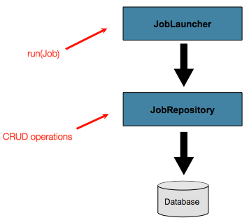
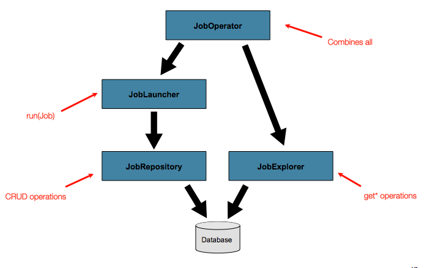

# 4.6 Meta-Data 高级用法 #

到目前为止，已经讨论了 **JobLauncher** 和 **JobRepository** 接口，它们展示了简单启动任务，以及批处理领域对象的基本CRUD操作：

 
一个JobLauncher使用一个JobRepository创建并运行新的JobExection对象，Job和Step实现随后使用相同的JobRepository在job运行期间去更新相同的JobExecution对象。这些基本的操作能够满足简单场景的需要，但是对于有着数百个任务和复杂定时流程的大型批处理情况来说，就需要使用更高级的方式访问元数据：

 
接下去会讨论 **JobExplorer** 和 **JobOperator** 两个接口，能够使用更多的功能去查询和修改元数据。

## 4.6.1 Querying the Repository ##

在使用高级功能之前，需要最基本的方法来查询repository去获取已经存在的 `execution` 。**JobExplored** 接口提供了这些功能：

	public interface JobExplorer {
	
	    List<JobInstance> getJobInstances(String jobName, int start, int count);
	
	    JobExecution getJobExecution(Long executionId);
	
	    StepExecution getStepExecution(Long jobExecutionId, Long stepExecutionId);
	
	    JobInstance getJobInstance(Long instanceId);
	
	    List<JobExecution> getJobExecutions(JobInstance jobInstance);
	
	    Set<JobExecution> findRunningJobExecutions(String jobName);
	}

上面的代码表示的很明显，JobExplorer是一个只读版的JobRepository，同JobRepository一样，它也能够很容易配置一个工厂类：

	<bean id="jobExplorer" class="org.spr...JobExplorerFactoryBean"
	      p:dataSource-ref="dataSource" />

（[Earlier in this chapter](http://docs.spring.io/spring-batch/trunk/reference/html/configureJob.html#repositoryTablePrefix)）之前有提到过，**JobRepository** 能够配置不同的表前缀用来支持不同的版本或是schema。**JobExplorer** 也支持同样的特性：

	<bean id="jobExplorer" class="org.spr...JobExplorerFactoryBean"
	      p:dataSource-ref="dataSource" p:tablePrefix="BATCH_" />

## 4.6.2 JobRegistry ##

`JobRegistry`(父接口为`JobLocator`)并非强制使用，它能够协助用户在上下文中追踪job是否可用，也能够在应用上下文收集在其他地方(子上下文)创建的job信息。自定义的JobRegistry实现常被用于操作job的名称或是其他属性。框架提供了一个基于map的默认实现，能够从job的名称映射到job的实例：

	<bean id="jobRegistry" class="org.spr...MapJobRegistry" />

有两种方法自动注册job进JobRegistry：使用bean的post处理器或是使用注册生命周期组件。这两种机制在下面描述。

**JobRegistryBeanPostProcessor**

这是post处理器，能够将job在创建时自动注册进JobRegistry：

	<bean id="jobRegistryBeanPostProcessor" class="org.spr...JobRegistryBeanPostProcessor">
	    <property name="jobRegistry" ref="jobRegistry"/>
	</bean>

并不一定要像例子中给post处理器一个id，但是使用id可以在子context中(比如作为作为父 bean 定义)也使用post处理器，这样所有的job在创建时都会自动注册进JobRegistry。

**AutomaticJobRegistrar**

这是生命周期组件，用于创建子context以及注册这些子context中的job。这种做法有一个好处，虽然job的名字仍然要求全局唯一，但是job的依赖项可以不用全局唯一，它可以有一个“自然”的名字。例如，创建了一组xml配置文件，每个文件有一个job，每个job的ItemReader都有一个相同的名字(如"reader")，如果这些文件被导入到一个上下文中，reader的定义会冲突并且互相覆盖。如果使用了自动注册机就能避免这一切发生。这样集成几个不同的应用模块就变得更容易了：

	<bean class="org.spr...AutomaticJobRegistrar">
	   <property name="applicationContextFactories">
	      <bean class="org.spr...ClasspathXmlApplicationContextsFactoryBean">
	         <property name="resources" value="classpath*:/config/job*.xml" />
	      </bean>
	   </property>
	   <property name="jobLoader">
	      <bean class="org.spr...DefaultJobLoader">
	         <property name="jobRegistry" ref="jobRegistry" />
	      </bean>
	   </property>
	</bean>

注册机有两个主要的属性，一个是ApplicationContextFactory数组(这儿创建了一个简单的factory bean)，另一个是 `jobLoader`。**JobLoader** 负责管理子context的生命周期以及注册任务到JobRegistry。

**ApplicationContextFactory** 负责创建子 **Context**，大多数情况下像上面那样使用 **ClassPathXmlApplicationContextFactory**。这个工厂类的一个特性是默认情况下他会复制父上下文的一些配置到子上下文。因此如果不变的情况下不需要重新定义子上下文中的 **PropertyPlaceholderConfigurer** 和AOP配置。

在必要情况下，**AutomaticJobRegistrar** 可以和 **JobRegistyBeanPostProcessor** 一起使用。例如，job有可能既定义在父上下文中也定义在子上下文中的情况。

## 4.6.3 JobOperator ##

正如前面所讨论的，JobRepository 提供了对元数据的 CRUD 操作，JobExplorer 提供了对元数据的只读操作。然而，这些操作最常用于联合使用诸多的批量操作类，来对任务进行监测，并完成相当多的任务控制功能，比如停止、重启或对任务进行汇总。在Spring Batch 中JobOperator 接口提供了这些操作类型：
	
	public interface JobOperator {
	
	    List<Long> getExecutions(long instanceId) throws NoSuchJobInstanceException;
	
	    List<Long> getJobInstances(String jobName, int start, int count)
	          throws NoSuchJobException;
	
	    Set<Long> getRunningExecutions(String jobName) throws NoSuchJobException;
	
	    String getParameters(long executionId) throws NoSuchJobExecutionException;
	
	    Long start(String jobName, String parameters)
	          throws NoSuchJobException, JobInstanceAlreadyExistsException;
	
	    Long restart(long executionId)
	          throws JobInstanceAlreadyCompleteException, NoSuchJobExecutionException,
	                  NoSuchJobException, JobRestartException;
	
	    Long startNextInstance(String jobName)
	          throws NoSuchJobException, JobParametersNotFoundException, JobRestartException,
	                 JobExecutionAlreadyRunningException, JobInstanceAlreadyCompleteException;
	
	    boolean stop(long executionId)
	          throws NoSuchJobExecutionException, JobExecutionNotRunningException;
	
	    String getSummary(long executionId) throws NoSuchJobExecutionException;
	
	    Map<Long, String> getStepExecutionSummaries(long executionId)
	          throws NoSuchJobExecutionException;
	
	    Set<String> getJobNames();
	
	}

上图中展示的操作重现了来自其它接口提供的方法，比如JobLauncher, JobRepository, JobExplorer, 以及 JobRegistry。因为这个原因，所提供的JobOperator的实现SimpleJobOperator的依赖项有很多：

	<bean id="jobOperator" class="org.spr...SimpleJobOperator">
	    <property name="jobExplorer">
	        <bean class="org.spr...JobExplorerFactoryBean">
	            <property name="dataSource" ref="dataSource" />
	        </bean>
	    </property>
	    <property name="jobRepository" ref="jobRepository" />
	    <property name="jobRegistry" ref="jobRegistry" />
	    <property name="jobLauncher" ref="jobLauncher" />
	</bean>
 
**注意**
如果你在JobRepository中设置了表前缀，那么不要忘记在JobExplorer中也做同样设置。

## 4.6.4 JobParametersIncrementer ##

**JobOperator** 的多数方法都是不言自明的，更多详细的说明可以参见该接口的javadoc([javadoc of the interface](http://docs.spring.io/spring-batch/apidocs/org/springframework/batch/core/launch/JobOperator.html))。然而startNextInstance方法却有些无所是处。这个方法通常用于启动Job的一个新的实例。但如果 JobExecution 存在若干严重的问题，同时该Job 需要从头重新启动，那么这时候这个方法就相当有用了。不像JobLauncher ，启动新的任务时如果参数不同于任何以往的参数集，这就要求一个新的 JobParameters 对象来触发新的 JobInstance，startNextInstance 方法将使用当前的JobParametersIncrementer绑定到这个任务，并强制其生成新的实例：

	public interface JobParametersIncrementer {
	    JobParameters getNext(JobParameters parameters);
	}

**JobParametersIncrementer** 的协议是这样的，当给定一个 [JobParameters](http://docs.spring.io/spring-batch/trunk/reference/html/configureJob.html) 对象，它将返回填充了所有可能需要的值 “下一个” JobParameters 对象。这个策略非常有用，因为框架无需知晓变成“下一个”的JobParameters 做了哪些更改。例如，如果任务参数中只包含一个日期参数，那么当创建下一个实例时，这个值就应该是不是该自增一天？或者一周（如果任务是以周为单位运行的话）？任何包含数值类参数的任务，如果需要对其进行区分，都涉及这个问题，如下：

	public class SampleIncrementer implements JobParametersIncrementer {
	
	    public JobParameters getNext(JobParameters parameters) {
	        if (parameters==null || parameters.isEmpty()) {
	            return new JobParametersBuilder().addLong("run.id", 1L).toJobParameters();
	        }
	        long id = parameters.getLong("run.id",1L) + 1;
	        return new JobParametersBuilder().addLong("run.id", id).toJobParameters();
	    }
	}

在该示例中，键值“`run.id`”用以区分各个JobInstance。如果当前的JobParameters为空(null)，它将被视为该Job从未运行过，并同时为其初始化，然后返回。反之，非空的时候自增一个数值，再返回。自增的数值可以在命名空间描述中通过Job的“incrementer”属性进行设置：

	<job id="footballJob" incrementer="sampleIncrementer">
	    ...
	</job>

## 4.6.5 Stopping a Job ##

**JobOperator** 最常见的作用莫过于停止某个Job：

	Set<Long> executions = jobOperator.getRunningExecutions("sampleJob");
	jobOperator.stop(executions.iterator().next());

关闭不是立即发生的，因为没有办法将一个任务立刻强制停掉，尤其是当任务进行到开发人员自己的代码段时，框架在此刻是无能为力的，比如某个业务逻辑处理。而一旦控制权还给了框架，它会立刻设置当前`StepExecution`为`BachStatus.STOPPED`，意为停止，然后保存，最后在完成前对**JobExecution**进行相同的操作。

## 4.6.6 Aborting a Job ##

一个job的执行过程当执行到FAILED状态之后，如果它是可重启的，它将会被重启。如果任务的执行过程状态是ABANDONED，那么框架就不会重启它。ABANDONED状态也适用于执行步骤，使得它们可以被跳过，即便是在一个可重启的任务执行之中：如果任务执行过程中碰到在上一次执行失败后标记为ABANDONED的步骤，将会跳过该步骤直接到下一步(这是由任务流定义和执行步骤的退出码决定的)。

如果当前的系统进程死掉了(“kill -9”或系统错误)，job自然也不会运行，但JobRepository是无法侦测到这个错误的，因为进程死掉之前没有对它进行任何通知。你必须手动的告诉它，你知道任务已经失败了还是说考虑放弃这个任务（设置它的状态为FAILED或ABANDONED）-这是业务逻辑层的事情，无法做到自动决策。只有在不可重启的任务中才需要设置为FAILED状态，或者你知道重启后数据还是有效的。Spring Batch Admin中有一系列工具JobService，用以取消正在进行执行的任务。
