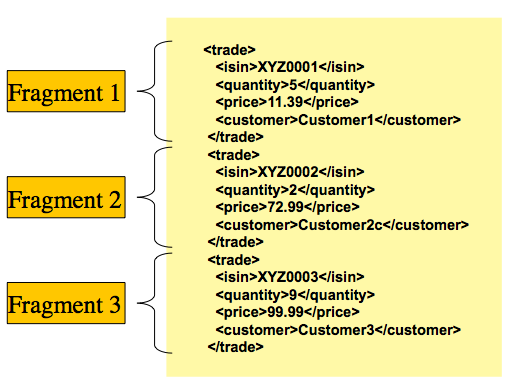

# 6.7 XML Item Readers and Writers #

Spring Batch provides transactional infrastructure for both reading XML records and mapping them to Java objects as well as writing Java objects as XML records.

**[Note]	Constraints on streaming XML**
The StAX API is used for I/O as other standard XML parsing APIs do not fit batch processing requirements (DOM loads the whole input into memory at once and SAX controls the parsing process allowing the user only to provide callbacks).

Lets take a closer look how XML input and output works in Spring Batch. First, there are a few concepts that vary from file reading and writing but are common across Spring Batch XML processing. With XML processing, instead of lines of records (FieldSets) that need to be tokenized, it is assumed an XML resource is a collection of 'fragments' corresponding to individual records:

Figure 3.1: XML Input

The 'trade' tag is defined as the 'root element' in the scenario above. Everything between '<trade>' and '</trade>' is considered one 'fragment'. Spring Batch uses Object/XML Mapping (OXM) to bind fragments to objects. However, Spring Batch is not tied to any particular XML binding technology. Typical use is to delegate to Spring OXM, which provides uniform abstraction for the most popular OXM technologies. The dependency on Spring OXM is optional and you can choose to implement Spring Batch specific interfaces if desired. The relationship to the technologies that OXM supports can be shown as the following:

Figure 3.2: OXM Binding

Now with an introduction to OXM and how one can use XML fragments to represent records, let's take a closer look at readers and writers.