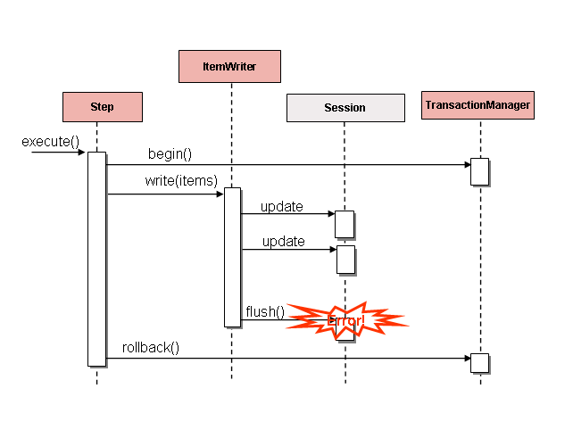
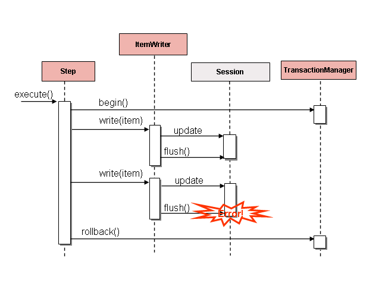

## 6.9.3 Database ItemWriters ##

While both Flat Files and XML have specific ItemWriters, there is no exact equivalent in the database world. This is because transactions provide all the functionality that is needed. ItemWriters are necessary for files because they must act as if they're transactional, keeping track of written items and flushing or clearing at the appropriate times. Databases have no need for this functionality, since the write is already contained in a transaction. Users can create their own DAOs that implement the ItemWriter interface or use one from a custom ItemWriter that's written for generic processing concerns, either way, they should work without any issues. One thing to look out for is the performance and error handling capabilities that are provided by batching the outputs. This is most common when using hibernate as an ItemWriter, but could have the same issues when using Jdbc batch mode. Batching database output doesn't have any inherent flaws, assuming we are careful to flush and there are no errors in the data. However, any errors while writing out can cause confusion because there is no way to know which individual item caused an exception, or even if any individual item was responsible, as illustrated below:

If items are buffered before being written out, any errors encountered will not be thrown until the buffer is flushed just before a commit. For example, let's assume that 20 items will be written per chunk, and the 15th item throws a DataIntegrityViolationException. As far as the Step is concerned, all 20 item will be written out successfully, since there's no way to know that an error will occur until they are actually written out. Once Session#flush() is called, the buffer will be emptied and the exception will be hit. At this point, there's nothing the Step can do, the transaction must be rolled back. Normally, this exception might cause the Item to be skipped (depending upon the skip/retry policies), and then it won't be written out again. However, in the batched scenario, there's no way for it to know which item caused the issue, the whole buffer was being written out when the failure happened. The only way to solve this issue is to flush after each item:

This is a common use case, especially when using Hibernate, and the simple guideline for implementations of ItemWriter, is to flush on each call to write(). Doing so allows for items to be skipped reliably, with Spring Batch taking care internally of the granularity of the calls to ItemWriter after an error.

