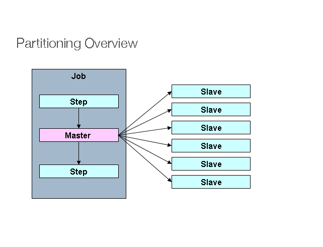

# 7.4 分区 #

Spring Batch也为Step的分区执行和远程执行提供了一个SPI(服务提供者接口)。在这种情况下,远端的执行程序只是一些简单的Step实例,配置和使用方式都和本机处理一样容易。下面是一幅实际的模型示意图:

在左侧执行的作业(Job)是串行的Steps,而中间的那一个Step被标记为 Master。图中的 Slave 都是一个Step的相同实例,对于作业来说,这些Slave的执行结果实际上等价于就是Master的结果。Slaves通常是远程服务,但也有可能是本地执行的其他线程。在此模式中,Master发送给Slave的消息不需要持久化(durable) ,也不要求保证交付: 对每个作业执行步骤来说,保存在 **JobRepository** 中的Spring Batch元信息将确保每个Slave都会且仅会被执行一次。

Spring Batch的SPI由Step的一个专门的实现(** PartitionStep**),以及需要由特定环境实现的两个策略接口组成。这两个策略接口分别是 **PartitionHandler** 和 **StepExecutionSplitter**,他们的角色如下面的序列图所示:

此时在右边的Step就是“远程”Slave,所以可能会有多个对象 和/或 进程在扮演这一角色,而图中的 PartitionStep 在驱动(/控制)整个执行过程。PartitionStep的配置如下所示:

	<step id="step1.master">
	    <partition step="step1" partitioner="partitioner">
	        <handler grid-size="10" task-executor="taskExecutor"/>
	    </partition>
	</step>

类似于多线程step的 throttle-limit 属性, grid-size属性防止单个Step的任务执行器过载。

在Spring Batch Samples示例程序中有一个简单的例子在单元测试中可以拷贝/扩展(详情请参考 ***PartitionJob.xml** 配置文件)。

Spring Batch 为分区创建执行步骤,名如“step1:partition0”,等等,所以我们经常把Master step叫做“step1:master”。在Spring 3.0中也可以为Step指定别名(通过指定 **name** 属性,而不是 **id** 属性)。

## 7.4.1 分区处理器(PartitionHandler) ##

**PartitionHandler**组件知道远程网格环境的组织结构。 它可以发送**StepExecution**请求给远端Steps,采用某种具体的数据格式,例如DTO.它不需要知道如何分割输入数据,或者如何聚合多个步骤执行的结果。一般来说它可能也不需要了解弹性或故障转移,因为在许多情况下这些都是结构的特性,无论如何Spring Batch总是提供了独立于结构的可重启能力: 一个失败的作业总是会被重新启动,并且只会重新执行失败的步骤。

**PartitionHandler**接口可以有各种结构的实现类: 如简单RMI远程方法调用,EJB远程调用,自定义web服务、JMS、Java Spaces, 共享内存网格(如Terracotta或Coherence)、网格执行结构(如GridGain)。Spring Batch自身不包含任何专有网格或远程结构的实现。

但是 Spring Batch也提供了一个有用的**PartitionHandler**实现，在本地分开的线程中执行Steps,该实现类名为 **TaskExecutorPartitionHandler**,并且他是上面的XML配置中的默认处理器。还可以像下面这样明确地指定:

	<step id="step1.master">
	    <partition step="step1" handler="handler"/>
	</step>
	
	<bean class="org.spr...TaskExecutorPartitionHandler">
	    <property name="taskExecutor" ref="taskExecutor"/>
	    <property name="step" ref="step1" />
	    <property name="gridSize" value="10" />
	</bean>

**gridSize**决定要创建的独立的step执行的数量,所以它可以配置为**TaskExecutor**中线程池的大小,或者也可以设置得比可用的线程数稍大一点,在这种情况下,执行块变得更小一些。

**TaskExecutorPartitionHandler** 对于IO密集型步骤非常给力,比如要拷贝大量的文件,或复制文件系统到内容管理系统时。它还可用于远程执行的实现,通过为远程调用提供一个代理的步骤实现(例如使用Spring Remoting)。

## 7.4.2 分割器(Partitioner) ##

分割器有一个简单的职责: 仅为新的step实例生成执行环境(contexts),作为输入参数(这样重启时就不需要考虑)。 该接口只有一个方法:

	public interface Partitioner {
	    Map<String, ExecutionContext> partition(int gridSize);
	}

这个方法的返回值是一个Map对象,将每个Step执行分配的唯一名称(Map泛型中的 **String**),和与其相关的输入参数以**ExecutionContext** 的形式做一个映射。
这个名称随后在批处理 meta data 中作为分区 **StepExecutions** 的Step名字显示。 **ExecutionContext**仅仅只是一些 名-值对的集合,所以它可以包含一系列的主键,或行号,或者是输入文件的位置。 然后远程**Step** 通常使用 **#{...}**占位符来绑定到上下文输入(在 step作用域内的后期绑定),详情请参见下一节。

step执行的名称( **Partitioner**接口返回的 **Map** 中的 key)在整个作业的执行过程中需要保持唯一,除此之外没有其他具体要求。 要做到这一点,并且需要一个对用户有意义的名称,最简单的方法是使用 前缀+后缀 的命名约定,前缀可以是被执行的Step的名称(这本身在作业**Job**中就是唯一的),后缀可以是一个计数器。在框架中有一个使用此约定的 **SimplePartitioner**。

有一个可选接口 **PartitioneNameProvider** 可用于和分区本身独立的提供分区名称。 如果一个 **Partitioner** 实现了这个接口, 那么重启时只有names会被查询。 如果分区是重量级的，那么这可能是一个很有用的优化。 很显然,**PartitioneNameProvider**提供的名称必须和**Partitioner**提供的名称一致。

## 7.4.3 将输入数据绑定到 Steps ##

因为step的输入参数在运行时绑定到ExecutionContext中,所以由相同配置的PartitionHandler执行的steps是非常高效的。 通过 Spring Batch的StepScope特性这很容易实现(详情请参考 [后期绑定](http://docs.spring.io/spring-batch/trunk/reference/html/configureStep.html#late-binding))。 例如,如果 **Partitioner** 创建 **ExecutionContext** 实例, 每个step执行都以**fileName**为key 指向另一个不同的文件(或目录),则 **Partitioner** 的输出看起来可能像下面这样:

**表 7.1. 由执行目的目录处理Partitioner提供的的step执行上下文名称示例**

	| Step Execution Name (key) |	ExecutionContext (value)  |
	| filecopy:partition0	    |   fileName=/home/data/one   |
	| filecopy:partition1	    |   fileName=/home/data/two   |
	| filecopy:partition2	    |   fileName=/home/data/three |

然后就可以将文件名绑定到 step 中, step使用了执行上下文的后期绑定:

	<bean id="itemReader" scope="step"
	      class="org.spr...MultiResourceItemReader">
	    <property name="resource" value="#{stepExecutionContext[fileName]}/*"/>
	</bean>

