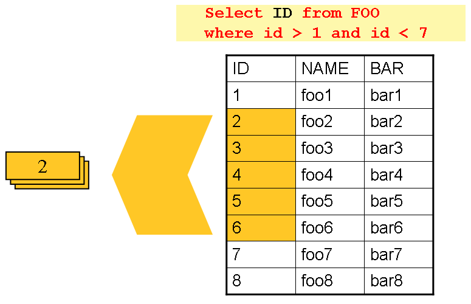
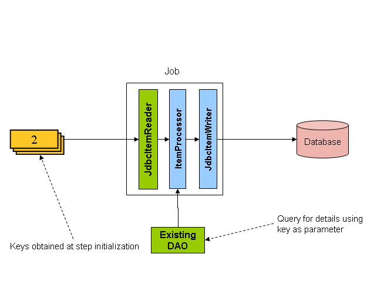

#11.通用批处理模型

>一些批处理任务可以使用spring batch现成的组件完全的组装.例如ItemReader和ItemWriter实现可配置覆盖范围广泛的场景,然而,对于大多数情况下,必须编写自定义代码。应用程序开发人员的主要API人口点是Tasklet,ItemReader ItemWriter和各种各样的监听器接口.最简单的批处理任务能够使用Spring BatchItemReader现成的输出,但通常情况下,自定义问题的处理和写作,需要开发人员实现一个ItemWriter或ItemProcessor.
>
>在这里,我们提供了一个通用模式自定义业务逻辑的一些例子.这些例子的主要特性是监听器接口,应该注意的是,如果合适,一个ItemReader或ItemWriter也可以实现一个监听器接口。

##11.1日志项处理和失败

一个常见的用例是需要在一个步骤中特殊处理错误,chunk-oriented步骤(从创建工厂bean的这个步骤)允许用户实现一个简单的ItemReadListener用例,用来监听读入错误,和一个ItemWriteListener,用来监听写出错误.下面的代码片段说明一个监听器监听失败日志的读写:
	>public class ItemFailureLoggerListener extends ItemListenerSupport {

    private static Log logger = LogFactory.getLog("item.error");

    public void onReadError(Exception ex) {
        logger.error("Encountered error on read", e);
    }

    public void onWriteError(Exception ex, Object item) {
        logger.error("Encountered error on write", ex);
    }

	}

在实现此监听器必须注册步骤:

	<step id="simpleStep">
   	 ...
   	 <listeners>
       	<listener>
         	   &lt;bean class="org.example...ItemFailureLoggerListener"/>
        	</listener>
   	 </listeners>
	</step>

记住,如果你的监听器在任何一个onError()方法中,它将在一个事务中回滚.如果在一个onError()方法中需要使用事务性的资源(比如数据库),可以考虑添加一个声明式事务方法(有关详细信息,请参阅Spring核心参考指南),并给予其传播属性REQUIRES_NEW值。

##11.2 业务原因手工停止任务

Spring Batch通过JobLauncher接口提供一个stop()方法,但是这实际上是给维护人员用的,而不是程序员.有时有更方便和更有意义的阻止任务中的业务逻辑执行.

最简单的做法是抛出一个RuntimeException(不是无限的重试或跳过).例如,可以使用一个自定义异常类型,如以下示例:
	public class PoisonPillItemWriter implements ItemWriter<T> {

    public void write(T item) throws Exception {
        if (isPoisonPill(item)) {
            throw new PoisonPillException("Posion pill detected: " + item);
       }
    }

	}

ItemReader中阻止一个步骤执行的另一种简单的方法是简单地返回null:
	public class EarlyCompletionItemReader implements ItemReader<T> {

    private ItemReader<T> delegate;

    public void setDelegate(ItemReader<T> delegate) { ... }

    public T read() throws Exception {
        T item = delegate.read();
        if (isEndItem(item)) {
            return null; // end the step here
        }
        return item;
    }

	}

前面的例子实际上依赖于这样一个事实,当item处理是null时,有一个默认的实现CompletionPolicy的策略来实现批处理,更复杂完善是策略可以通过SimpleStepFactoryBean实现和注入Step:

	<step id="simpleStep">
    <tasklet>
        <chunk reader="reader" writer="writer" commit-interval="10"
               chunk-completion-policy="completionPolicy"/>
    </tasklet>
	</step>
	
	<bean id="completionPolicy" class="org.example...SpecialCompletionPolicy"/>

另一种方法是在框架启动处理item的时候检查step设置一个标志StepExecution.实现这个替代方案,我们需要使用当前的StepExecution,这可以通过实现一个StepListener 和注册step:

	public class CustomItemWriter extends ItemListenerSupport implements StepListener 	{
	
	    private StepExecution stepExecution;
	
	    public void beforeStep(StepExecution stepExecution) {
	        this.stepExecution = stepExecution;
	    }
	
	    public void afterRead(Object item) {
	        if (isPoisonPill(item)) {
	            stepExecution.setTerminateOnly(true);
	       }
	    }

	}

在这里flag设置默认的行为是step抛出一个JobInterruptedException.这可以通过StepInterruptionPolicy控制,但唯一的选择是抛出一个exception,所以这个job总是一个异常的结束.

##11.3 添加一个Footer记录

经常写文本文件时,在所有处理都已经完成,一个"footer" 记录必须附加到文件的末尾.这也可以通过使用由Spring Batch提供的FlatFileFooterCallback接口,FlatFileItemWriter的FlatFileFooterCallback(和与之对应的FlatFileHeaderCallback)是可选的属性.

	<bean id="itemWriter" class="org.spr...FlatFileItemWriter">
	    <property name="resource" ref="outputResource" />
	    <property name="lineAggregator" ref="lineAggregator"/>
	    <property name="headerCallback" ref="headerCallback" />
	    <property name="footerCallback" ref="footerCallback" />
	</bean>

footer回调接口非常简单,它只有一个方法调用.

	public interface FlatFileFooterCallback {

	    void writeFooter(Writer writer) throws IOException;

	}

### 11.3.1 写一个简单Footer

是一个非常常见的需求涉及到footer记录,在输出过程中总计信息然后把这信息附加到文件末尾.这footer作为文件的总结或提供了一个校验和。

例如,如果一个批处理作业是flat文件写贸易记录,所有交易的totalAmount需要放置在footer,然后可以使用followingItemWriter实现:

	public class TradeItemWriter implements ItemWriter<Trade>,
                                        FlatFileFooterCallback {

    private ItemWriter<Trade> delegate;

    private BigDecimal totalAmount = BigDecimal.ZERO;

    public void write(List<? extends Trade> items) {
        BigDecimal chunkTotal = BigDecimal.ZERO;
        for (Trade trade : items) {
            chunkTotal = chunkTotal.add(trade.getAmount());
        }

        delegate.write(items);

        // After successfully writing all items
        totalAmount = totalAmount.add(chunkTotal);
    }

    public void writeFooter(Writer writer) throws IOException {
        writer.write("Total Amount Processed: " + totalAmount);
    }

    public void setDelegate(ItemWriter delegate) {...}

	}

TradeItemWriter存储的totalAmount值随着每笔交易Amount写出而增长,在交易处理完成后,框架将调用writeFooter,将总金额加入到文件中.注意,写方法使用一个临时变量,chunkTotalAmount,存储交易总数到chunk.这样做是为了确保如果发生跳过写出的方法,totalAmount将保持不变.只有在写出方法结束时,不抛出异常,我们将更新totalAmount.

为了writeFooter被调用,TradeItemWriter(因为实现了FlatFileFooterCallback接口)必须以footerCallback为属性名注入到FlatFileItemWriter 中

	<bean id="tradeItemWriter" class="..TradeItemWriter">
	    <property name="delegate" ref="flatFileItemWriter" />
	</bean>
	
	<bean id="flatFileItemWriter" class="org.spr...FlatFileItemWriter">
	   <property name="resource" ref="outputResource" />
	   <property name="lineAggregator" ref="lineAggregator"/>
	   <property name="footerCallback" ref="tradeItemWriter" />
	</bean>

如果step是不可重新开始的,TradeItemWriter只会正常运行.这是因为类是有状态(因为它存储了totalAmount),但totalAmount不是持久化到数据库中,因此,它不能被重启.为了使这个类可重新开始,ItemStream接口应该实现的open和update方法.

	public void open(ExecutionContext executionContext) {
	    if (executionContext.containsKey("total.amount") {
	        totalAmount = (BigDecimal) executionContext.get("total.amount");
	    }
	}
	
	public void update(ExecutionContext executionContext) {
	    executionContext.put("total.amount", totalAmount);
	}

ExecutionContext持久化到数据库之前,update方法将存储totalAmount最新的值.open方法根据ExecutionContext中记录的处理起始点恢复totalAmount.在Step 中断执行之前,允许TradeItemWriter 重新启动

##11.4 基于ItemReaders的driving query

在readers 和writers章节中对数据库分页进行了讨论,很多数据库厂商,比如DB2,如果读表也需要使用的在线应用程序的其他部分,悲观锁策略,可能会导致问题.此外,打开游标在超大数据集可能导致某些供应商的问题.因此,许多项目更喜欢使用一个'Driving Query'的方式读入数据.这种方法是通过遍历keys,而不是整个对象,因此需要返回对象,如以下示例所示:

如您所见,这个例子使用一样的“FOO”表中使用基于指针的例子.然而,不是选择了整个行,只选择了ID的SQL语句.因此,返回一个整数,而不是返回FOO对象.这个数字可以用来查询的'details',这是一个完整的Foo对象:

ItemProcessor应该用转换的key从driving query得到一个完整的'Foo'对象,现有的Dao可以用查询完整的基于key的对象

##11.5 多行记录

虽然通常的flat文件,每个记录限制是一行,但是一个文件可能与多种格式多行记录,这是很常见的.以下摘录文件说明了这一点:

	HEA;0013100345;2007-02-15
	NCU;Smith;Peter;;T;20014539;F
	BAD;;Oak Street 31/A;;Small Town;00235;IL;US
	FOT;2;2;267.34

之间的所有行从'HEA'开始和从'FOT'开始被认为是一个记录.有一些注意事项,必须正确地处理这种情况:
	不是一次读取一条记录,而是ItemReader必须读取多行的每一行记录作为一个分组.这样它就可以被完整的传递到ItemWriter.
	
	每一行可能需要标记不同的类型.

因为单行记录跨越多行,我们可能不知道有多少行,所以ItemReader必须总是小心的读一个完整的记录.为了做到这一点,一个自定义ItemReader,应该实现一个FlatFileItemReader的包装器

	<bean id="itemReader" class="org.spr...MultiLineTradeItemReader">
    <property name="delegate">
        <bean class="org.springframework.batch.item.file.FlatFileItemReader">
            <property name="resource" value="data/iosample/input/multiLine.txt" />
            <property name="lineMapper">
                <bean class="org.spr...DefaultLineMapper">
                    <property name="lineTokenizer" ref="orderFileTokenizer"/>
                    <property name="fieldSetMapper">
                        <bean class="org.spr...PassThroughFieldSetMapper" />
                    </property>
                </bean>
            </property>
        </bean>
    </property>
	</bean>

确保正确标记的每一行,特别是重要的固定长度的输入,可以将PatternMatchingCompositeLineTokenizer委托于FlatFileItemReader.见章节 “Multiple Record Types within a Single File”中的更多的细节.这个委托reader,会将FieldSet传递到PassThroughFieldSetMapper再返回每一行到ItemReader 包装器中.

	<bean id="orderFileTokenizer" class="org.spr...PatternMatchingCompositeLineTokenizer">
	    <property name="tokenizers">
	        <map>
	            <entry key="HEA*" value-ref="headerRecordTokenizer" />
	            <entry key="FOT*" value-ref="footerRecordTokenizer" />
	            <entry key="NCU*" value-ref="customerLineTokenizer" />
	            <entry key="BAD*" value-ref="billingAddressLineTokenizer" />
	        </map>
	    </property>
	</bean>

这个包装器必须能够识别结束的记录,所以它可以不断调用delegate的read()方法直到结束.
对于读取的每一行,该wrapper应该绑定返回的item,一旦读到footer结束,item应该传递给ItemProcessor和ItemWriter返回.
	private FlatFileItemReader<FieldSet> delegate;
	
	public Trade read() throws Exception {
	    Trade t = null;
	
	    for (FieldSet line = null; (line = this.delegate.read()) != null;) {
	        String prefix = line.readString(0);
	        if (prefix.equals("HEA")) {
	            t = new Trade(); // Record must start with header
	        }
	        else if (prefix.equals("NCU")) {
	            Assert.notNull(t, "No header was found.");
	            t.setLast(line.readString(1));
	            t.setFirst(line.readString(2));
	            ...
	        }
	        else if (prefix.equals("BAD")) {
	            Assert.notNull(t, "No header was found.");
	            t.setCity(line.readString(4));
	            t.setState(line.readString(6));
	          ...
	        }
	        else if (prefix.equals("FOT")) {
	            return t; // Record must end with footer
	        }
	    }
	    Assert.isNull(t, "No 'END' was found.");
	    return null;
	}

## 11.6 执行系统命令

许多批处理作业可能需要一个外部命令调用内部的批处理作业.这样一个过程可以分开调度,但常见的元数据对运行的优势将会丢失.此外,multi-step 作业需要分割成多个作业.

因此通常的 spring batch提供一个tasklet实现调用系统命令:

	<bean class="org.springframework.batch.core.step.tasklet.SystemCommandTasklet">
	    <property name="command" value="echo hello" />
	    <!-- 5 second timeout for the command to complete -->
	    <property name="timeout" value="5000" />
	</bean>

##11.7 当没有找到输入时Step处理完成

在许多批处理场景中,发现数据库或者文件中没有对应的行.Step只是认为没有找到工作和读入0行items.所有的ItemReader实现提供了开箱即用默认的Spring Batch方法.如果没有输出,可能会导致一些混乱,即使输入是当前的(如果一个文件通常是错误的,等等),为此,元数据本身应该检查以确定多少工作被框架发现和处理.然而,如果发现没有输入被认为只是例外呢?在这种情况下,以编程方式检查元数据有多少items没有被处理及其导致失败的原因,是最好的解决方案.这是一个常见的用例,一个监听器提供此功能:
	public class NoWorkFoundStepExecutionListener extends StepExecutionListenerSupport {
	
	    public ExitStatus afterStep(StepExecution stepExecution) {
	        if (stepExecution.getReadCount() == 0) {
	            return ExitStatus.FAILED;
	        }
	        return null;
	    }
	
	
	}

以上所述StepExecutionListener检查readCount属性,StepExecution 在'afterStep'阶段确定items是否被读取到,如果这样的话,一个退出代码返回FAILED,表明这个Step失败.否则,返回null,这不会影响step状态

##11.8 将数据传递给Future Steps

将一个步骤传递给另外一个步骤,这通常很有用.这可以通过使用ExecutionContext实现.值得注意的是,有两个ExecutionContexts:一个step层面,一个在job级别.Step级别ExecutionContext 生命周期和一个step一样长,然而 job级别ExecutionContext贯穿整个job.另一方面,每次更新Step级别ExecutionContext,该Step提交一个chunk,然而Job级别ExecutionContext更新只会存在最后一个	Step.
这种分离的结果是,step的执行过程中所有的数据必须放置在step级别ExecutionContext的执行.当step是on-going状态时,将确保数据存储是正确的.如果数据存储在job级别的ExecutionContext中,那么它将不是持久化状态的,在Step执行期间如果Step失败,则数据会丢失.

	public class SavingItemWriter implements ItemWriter<Object> {
	    private StepExecution stepExecution;
	
	    public void write(List<? extends Object> items) throws Exception {
	        // ...
	
	        ExecutionContext stepContext = this.stepExecution.getExecutionContext();
	        stepContext.put("someKey", someObject);
	    }
	
	    @BeforeStep
	    public void saveStepExecution(StepExecution stepExecution) {
	        this.stepExecution = stepExecution;
	    }
	}

使数据可用于future Steps,step完成之后Job级别ExecutionContext将有'promoted',Spring Batch为此提供了ExecutionContextPromotionListener.该监听器必须配置和数据相关的keys到ExecutionContext,它必须被提升.可选地,也可以配置的退出代码模式("COMPLETED" 是默认的),
与所有监听一样,它必须在step中注册

	<job id="job1">
	    <step id="step1">
	        <tasklet>
	            <chunk reader="reader" writer="savingWriter" commit-interval="10"/>
	        </tasklet>
	        <listeners>
	            <listener ref="promotionListener"/>
	        </listeners>
	    </step>
	
	    <step id="step2">
	       ...
	    </step>
	</job>
	
	<beans:bean id="promotionListener" class="org.spr....ExecutionContextPromotionListener">
	    <beans:property name="keys" value="someKey"/>
	</beans:bean>

最后,保存的值必须从job ExeuctionContext重新获得:

		public class RetrievingItemWriter implements ItemWriter<Object> {
	    private Object someObject;
	
	    public void write(List<? extends Object> items) throws Exception {
	        // ...
	    }
	
	    @BeforeStep
	    public void retrieveInterstepData(StepExecution stepExecution) {
	        JobExecution jobExecution = stepExecution.getJobExecution();
	        ExecutionContext jobContext = jobExecution.getExecutionContext();
	        this.someObject = jobContext.get("someKey");
	    }
	}